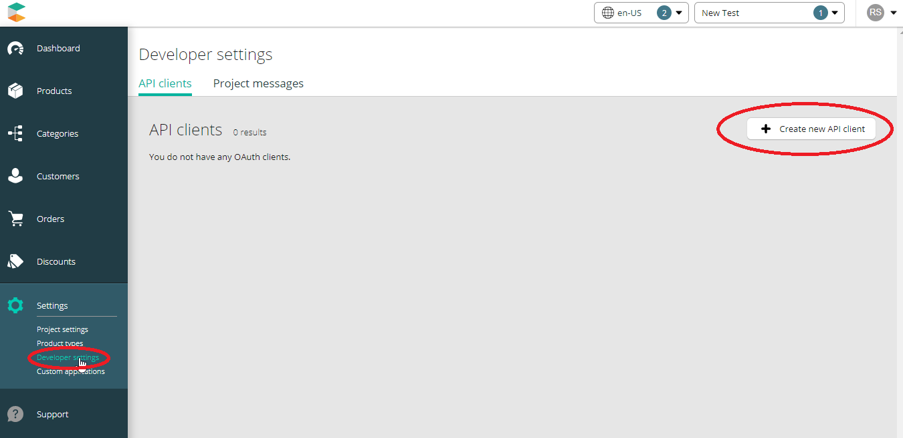
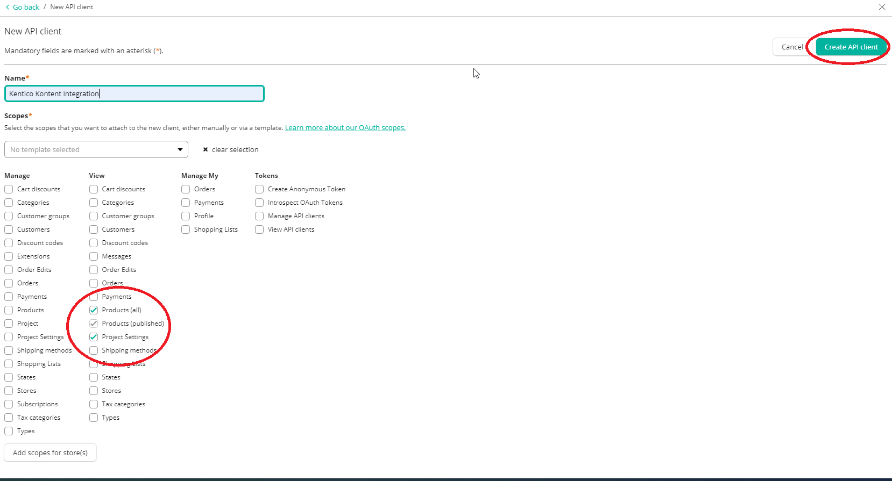
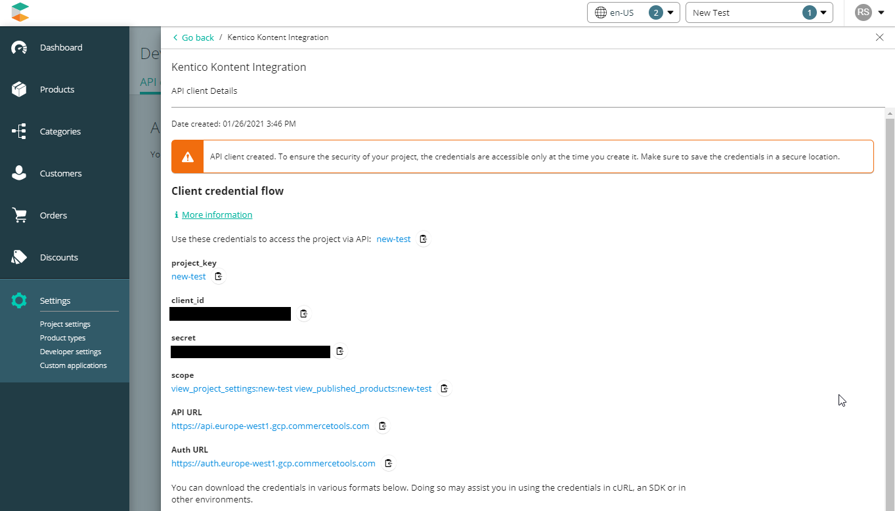
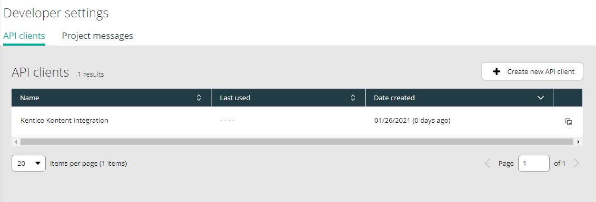

[![Core integration][core-shield]](https://kontent.ai/integrations/commercetools)

![Last modified][last-commit]
[![Issues][issues-shield]][issues-url]
[![Contributors][contributors-shield]][contributors-url]
[![Forks][forks-shield]][forks-url]
[![MIT License][license-shield]][license-url]

[![Stack Overflow][stack-shield]](https://stackoverflow.com/tags/kontent-ai)
[![Discord][discord-shield]](https://discord.gg/SKCxwPtevJ)

<p align="center">
<picture>
  <source media="(prefers-color-scheme: dark)" srcset="docs/kai-logo-hor-neg-rgb.svg">
  
</picture>
<picture>
  <source media="(prefers-color-scheme: dark)" srcset="docs/logo_no_claim_commercetools_RGB_horizontal_color-on-dark.svg">
  
</picture>
</p>

<p align="center">
  <a href="#features">Features</a> •
  <a href="#demo">Demo</a> •
  <a href="#quick-deploy">Deploy</a> •
  <a href="#configuring-the-custom-element">Configuration</a> •
  <a href="#what-is-saved">Saved value</a> •
  <a href="#developing">Developing</a> •
  <a href="#contributors">Contributors</a> •
  <a href="#license">License</a> •
  <a href="#additional-resources">Resources</a>
</p>

This [custom element](https://kontent.ai/learn/tutorials/develop-apps/integrate/content-editing-extensions/) extension for [Kontent.ai](https://kontent.ai) allows users to search and link selected products from [commercetools](https://commercetools.com) into their structured content.

## Features

- Editors can
  - Search for products in the commercetools project in all languages
  - Select a single product (or one of its variants)
  - Select multiple products (or their variants)

The element also offers an optional debug panel for diagnostics.

## Demo

![Demo Animation][product-demo]

## Quick Deploy

Netlify has made this easy. If you click the deploy button below, it will guide you through the process of deploying it to Netlify and leave you with a copy of the repository in your account as well.

[](https://app.netlify.com/start/deploy?repository=https://github.com/kontent-ai/custom-element-commercetools)


## Commercetools setup
In order to use this custom element extension with your commercetools account, you'll need to set up the integration in your [Merchant Center](https://mc.commercetools.com/). 

### Adding a new API client
- The custom element will be connecting to your commercetools account and searching for products to include into your Kontent.ai content item element. In order to set up this communication, a new API client has to be created under **Settings** -> **Developer settings** -> **Create new API client**.



- Next, a dialog for your Kontent.ai API client will be opened. Fill out the **Name** input field and under **Scopes** select **Products(all)** and **Project Settings** under the **View** category. This will give the extension read-only access to your product list, so it can be searched through while linking products to your content in Kontent.ai. 
- After your scopes and client name has been put in, click the **Create API client** button in the top right of the screen.



- All the important information you'll need to set up the custom element will be right in front of you. 



- Copy all the generated credentials as these will be needed for the custom element setup that takes place inside the Kontent.ai application. The [following section](#configuring-the-custom-element) describes each of the generated settings and shows you, how to create the final configuration object for your element. 


> **⚠ WARNING: You won't be able to access the credentials screen once you close it.**
> Be sure to copy and place all the generated credentials into your custom element configuration, otherwise, you'll be forced to re-create the API client. 




- Once you configure your custom element with the generated credentials, you can close the credentials window and confirm, that your API client has been successfully created.

## Configuring the Custom Element

You will need to add the custom element to a content type filling in the hosted code URL and the following JSON parameters:


| Name                         | Type    | Description                                                                                                                                                                                                                                                                                                                                                                    |
|------------------------------|---------|--------------------------------------------------------------------------------------------------------------------------------------------------------------------------------------------------------------------------------------------------------------------------------------------------------------------------------------------------------------------------------|
| isMultiSelect                  | boolean | If set to true, it will be possible to select multiple products. If set to false, it will be possible to only select a single product                                                                                                                                                                                                                                          |
| commercetools                | object  | This contains all the details required to connect to the [commercetools API](https://docs.commercetools.com/http-api). The values for this object will be derived from an API client that you configure in commercetools with the exception of the `defaultCulture`. When generating the API client, be sure to select the `view_products` and `view_project_settings` scopes. |
| commercetools.defaultCulture | string  | Set this to the IETF language tag of the language in commercetools to use by default for search.                                                                                                                                                                                                                                                                               |
| commercetools.projectKey     | string  | This is the commercetools project key.                                                                                                                                                                                                                                                                                                                                         |
| commercetools.clientId       | string  | This is the commercetools API client ID.                                                                                                                                                                                                                                                                                                                                       |
| commercetools.secret         | string  | This is the commercetools API client secret.                                                                                                                                                                                                                                                                                                                                   |
| commercetools.oauthUrl       | string  | This is the base URL to use for authenticating with commercetools.                                                                                                                                                                                                                                                                                                             |
| commercetools.apiUrl         | string  | This is the base URL to use for commercetools API calls.                                                                                                                                                                                                                                                                                                                       |
| commercetools.scope          | string  | This is the list of scopes that the client has. This should include the `view_products` and `view_project_settings` scopes.                                                                                                                                                                                                                                                    |

Sample parameters JSON:

```json
{
    "isMultiSelect": true,
    "commercetools": {
        "defaultCulture": "en",
        "projectKey": "your-project",
        "clientId": "your-client-id",
        "secret": "your-client-secret",
        "oauthUrl": "https://auth.sphere.io",
        "apiUrl": "https://api.sphere.io",
        "scope": "view_products:your-project view_project_settings:your-project"
    }
}
```

## What is Saved

The custom element will store the selected product's information in the following format:

```json
[{
  "id": "<GUID_OF_PRODUCT>",
  "variantId": "<Variant_ID>",
  "culture": "<IETF_LANGUAGE_TAG>"
}]
```

This value will be accessible though the [Kontent.ai Delivery API](https://kontent.ai/learn/reference/delivery-api) once the content item, containing the custom element, will be saved (through preview), or published (production).

## Developing

```bash
# Initial project setup
$ npm install

# Compile and minify for production
$ npm run build

# Compile and run on local server
$ npm start
```

The custom element is created with [Create React App](https://create-react-app.dev/).

## Contributors
We have collected notes on how to contribute to this project in [CONTRIBUTING.md](CONTRIBUTING.md).

<a href="https://github.com/kontent-ai/custom-element-commercetools/graphs/contributors">
  
</a>

## License

[MIT](https://tldrlegal.com/license/mit-license)

## Additional Resources

- [Kontent.ai Integration documentation](https://kontent.ai/learn/tutorials/develop-apps/integrate/integrations-overview)
- [Custom Element documentation](https://kontent.ai/learn/tutorials/develop-apps/integrate/content-editing-extensions)
- [Custom Element API reference](https://kontent.ai/learn/reference/custom-elements-js-api)


[last-commit]: https://img.shields.io/github/last-commit/kontent-ai/custom-element-commercetools?style=for-the-badge
[contributors-shield]: https://img.shields.io/github/contributors/kontent-ai/custom-element-commercetools.svg?style=for-the-badge
[contributors-url]: https://github.com/kontent-ai/custom-element-commercetools/graphs/contributors
[forks-shield]: https://img.shields.io/github/forks/kontent-ai/custom-element-commercetools.svg?style=for-the-badge
[forks-url]: https://github.com/kontent-ai/custom-element-commercetools/network/members
[issues-shield]: https://img.shields.io/github/issues/kontent-ai/custom-element-commercetools.svg?style=for-the-badge
[issues-url]: https://github.com/kontent-ai/custom-element-commercetools/issues
[license-shield]: https://img.shields.io/github/license/kontent-ai/custom-element-commercetools.svg?style=for-the-badge
[license-url]: https://github.com/kontent-ai/custom-element-commercetools/blob/master/LICENSE
[core-shield]: https://img.shields.io/static/v1?label=&message=core%20integration&color=FF5733&style=for-the-badge
[stack-shield]: https://img.shields.io/badge/Stack%20Overflow-ASK%20NOW-FE7A16.svg?logo=stackoverflow&logoColor=white&style=for-the-badge
[discord-shield]: https://img.shields.io/discord/821885171984891914?label=Discord&logo=Discord&logoColor=white&style=for-the-badge
[product-demo]: docs/commercetools-demo.gif?raw=true
